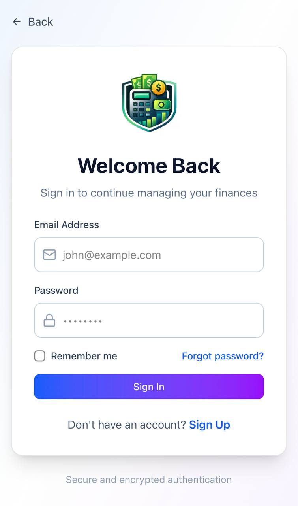
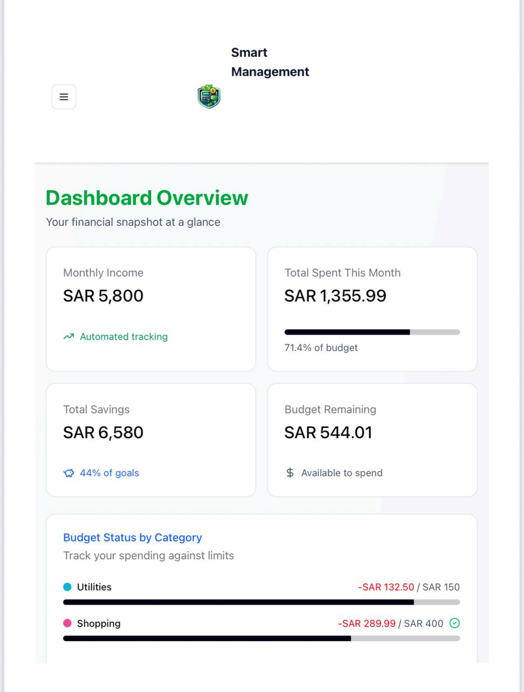
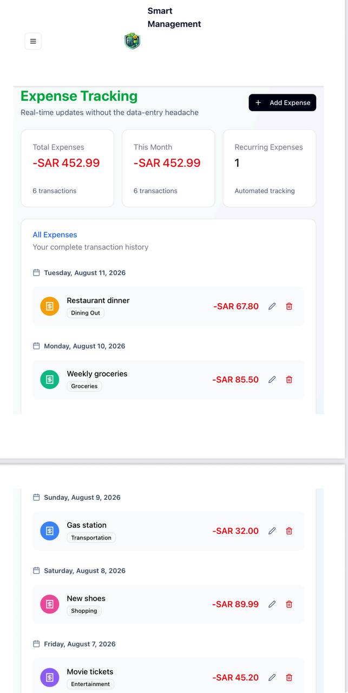
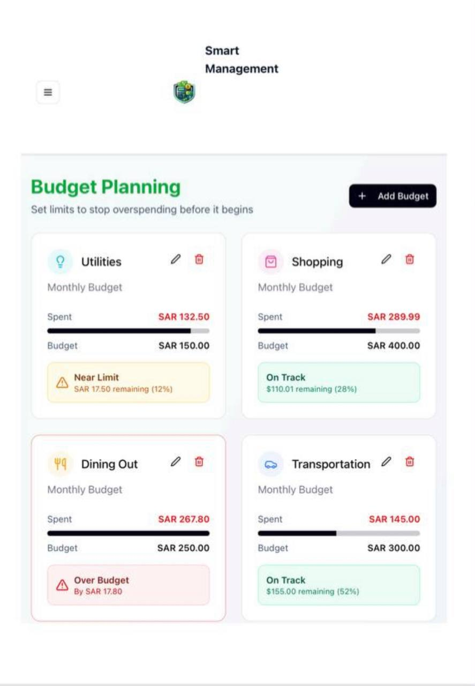
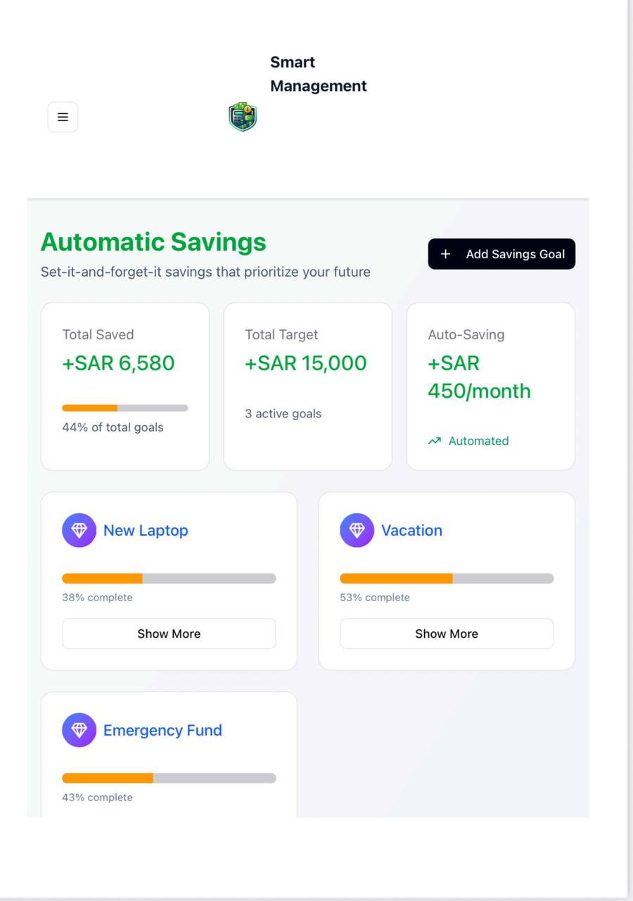

# Smart Expense Management

Smart Expense Management is a high-fidelity prototype designed in Figma to help users manage their personal expenses and budgets in a simple way.

## About the Project

The idea of this project is to make managing personal finances easier. Users can record their expenses, set budgets, track their savings, and view their spending information in one place.

We started by interviewing users to understand the problems they face when managing their money. Based on their feedback, we created paper prototypes and then developed the final high-fidelity prototype in Figma.

## Main Features

- Add and track expenses
- Set and manage budgets
- Track savings goals
- View spending information
- Receive notifications
- View monthly summaries

## Prototype

You can try the prototype here:

[View Figma Prototype](https://guitar-skier-47299611.figma.site)

## Testing

We tested the prototype using different usability testing methods, including heuristic evaluation, visual design testing, functional usability testing, and a survey.

The survey included 66 participants. The results showed that:

- 95.5% completed the Add Expense task.
- 97% completed the Notifications task.

Based on the feedback, we improved the navigation, layout, icons, and feedback messages.

## Tools

- Figma
- Prototyping
- UI/UX Design
- User Research
- Usability Testing

## Team

- Zahra Al-mari
- Fatimah Al mer
- Sarah Alabbad
- Norah Al-harbi
- Ghadah Al-qahtani
- Roaa alhaddad
- Lama Alshaikh
- Maha Al-Harthi

Department of Computer Science  
Imam Abdulrahman bin Faisal University 

## Project Screenshots

### Login Screen

### Dashboard Overview

### Expense Tracking

### Budget Planning

### Automatic Savings

